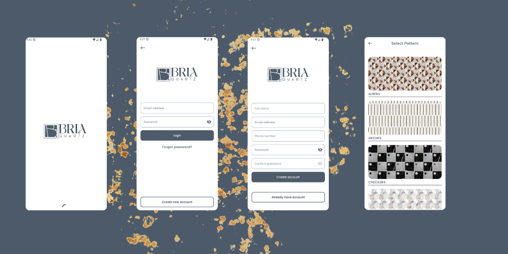
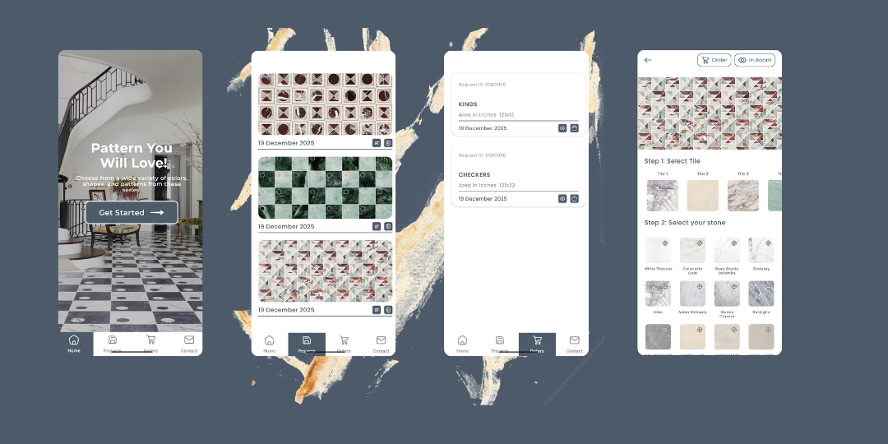
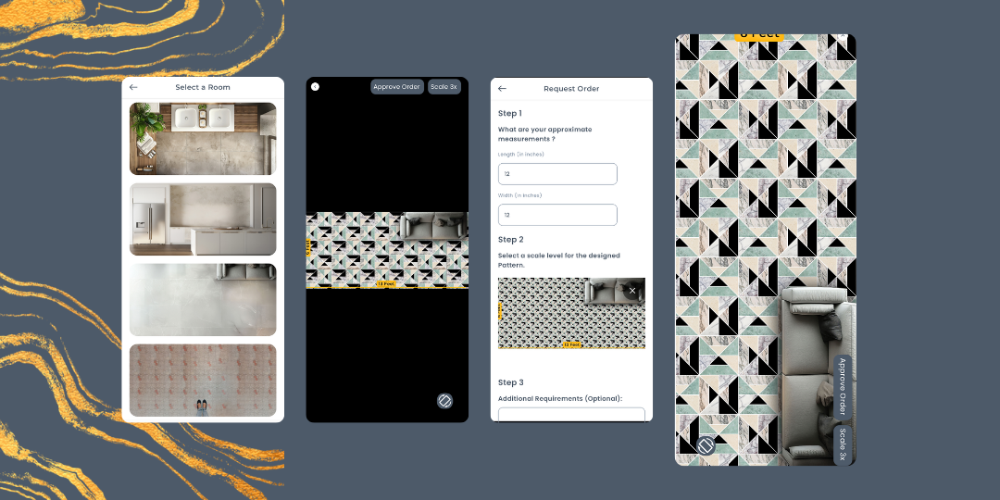

# Bria Quartz — Waterjet Pattern & Stone Customizer

Bria Quartz is a production-ready Android application designed for interior designers, architects, and homeowners to create, visualize, and order personalized waterjet stone patterns. The app allows users to customize complex geometric layouts with premium natural stones (e.g., Calacatta Gold, White Thassos) and visualize them in realistic room settings before placing precision cutting orders.

## 📱 Features & Core Functionality

*   **Intricate Pattern Customization:** Seamlessly pair complex geometric tile templates with a diverse catalog of natural marble and quartz stones.
*   **Real-time Room Visualization:** Preview custom pattern scaling and alignments dynamically across various room scenes (Kitchen, Living Room, etc.).
*   **End-to-End Ordering System:** Input physical measurements (Length/Width in inches), configure pattern scales, and submit custom requests directly through the app.
*   **Secure Authentication:** Secure user onboarding, profile creation, and account management.
*   **Offline-First Stability:** Browse previous projects, saved designs, and tracking statuses without active network connectivity.

---

## 📸 Previews

### 🔐 Onboarding & Authentication Flow

  

---

### 🎨 Customization & Projects Gallery

  

---

### 🛋️ Room Visualization & Ordering System

  

---

## 🛠️ Tech Stack & Architecture

This application is built using modern Android development practices, ensuring high performance, clean separation of concerns, and maintainable code architecture.

*   **UI Layer:** Built entirely with **Jetpack Compose** using declarative UI principles, state hoisting, and smooth material animations.
*   **Architecture Pattern:** **MVVM (Model-View-ViewModel)** coupled with Unidirectional Data Flow (UDF) to separate business logic from UI rendering.
*   **Local Storage (Offline-First):** **Room Database** utilizing reactive Kotlin Flows to cache user projects, selected tiles, and order histories locally.
*   **Networking Layer:** Robust data communication through **RESTful APIs** handling material catalogs, ordering configurations, and system data.
*   **Backend & Security:** **Firebase Integration** managing real-time data streaming, user session persistence, and secure authentications.
*   **Asynchronous Execution:** Optimized concurrency managed via **Kotlin Coroutines** and **StateFlow** to handle heavy image rendering and processing off the main thread without frame drops.

---

## 🏗️ Technical Highlights & Optimization

*   **Dynamic UI Composition:** Leveraged Jetpack Compose's lazy layouts to efficiently handle memory footprints while scrolling through high-resolution marble and quartz texture galleries.
*   **Robust Local Caching:** Designed an offline-first data synchronization strategy where data seamlessly loads from the local SQLite cache via Room while background workers check API endpoints for texture updates.
*   **Precision Form Validation:** Built a type-safe input validation mechanism for the physical dimensional mapping (inches/scaling levels) required for physical waterjet cutting machines.

---

## 🚀 Getting Started

### Prerequisites
*   Android Studio Ladybug (or newer)
*   JDK 17+
*   Android SDK 34+

